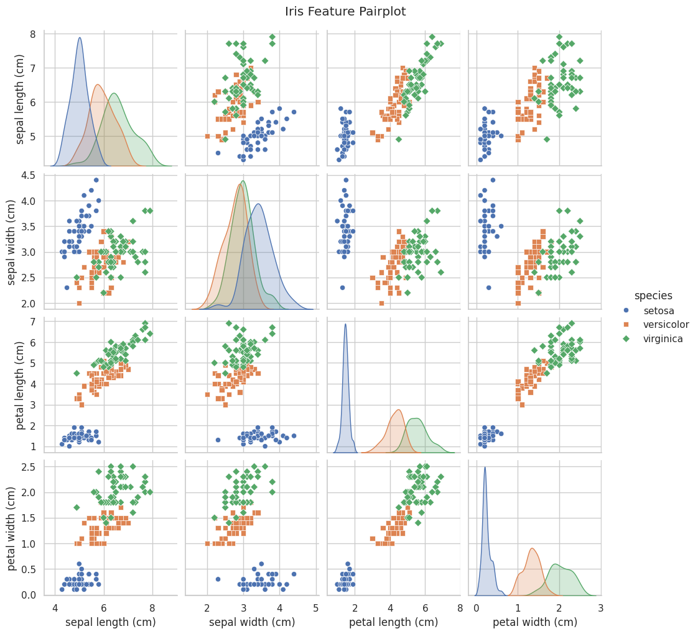

# 🌸 Iris Flower Classification & Web App

A complete machine learning project featuring comprehensive Exploratory Data Analysis (EDA), multi-algorithm multi-class classification, and a premium Streamlit web application.

## 🚀 Features

- **EDA & Visualization:** Detailed analysis with pairplots, boxplots, and correlation heatmaps.
- **Model Experimentation:** Comparison of 5 classification algorithms:
  - Logistic Regression
  - K-Nearest Neighbors (KNN)
  - Support Vector Machine (SVM) - *Best Performer*
  - Decision Tree
  - Random Forest
- **Web Application:** A premium Streamlit dashboard with interactive sliders for real-time predictions.
- **Reproducibility:** Seeded random states and professional environment configuration.

## 🛠️ Installation

1. **Clone the repository:**
   ```bash
   git clone https://github.com/YOUR_USERNAME/iris-flower-classification.git
   cd iris-flower-classification
   ```

2. **Create and activate a virtual environment:**
   ```bash
   python3 -m venv venv
   source venv/bin/activate
   ```

3. **Install dependencies:**
   ```bash
   pip install -r requirements.txt
   ```

## 📖 Usage

### Training and Analysis
Run the classification script to perform EDA and train the models:
```bash
python iris_classification.py
```

### Web Application
Launch the interactive Streamlit dashboard:
```bash
streamlit run app.py
```

## 📊 Results Summary

| Model | Accuracy | F1-Score (Macro) |
| :--- | :--- | :--- |
| **SVM** | **1.0000** | **1.0000** |
| Logistic Regression| 0.9333 | 0.9333 |
| KNN (n=5) | 0.9333 | 0.9327 |
| Decision Tree | 0.9333 | 0.9333 |
| Random Forest | 0.9000 | 0.9000 |

## 🖼️ Screenshots

### Web Application UI


### Feature Pairplot


---
Built with ❤️ using Scikit-Learn and Streamlit.
